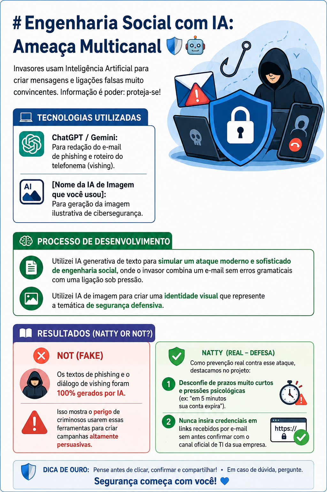
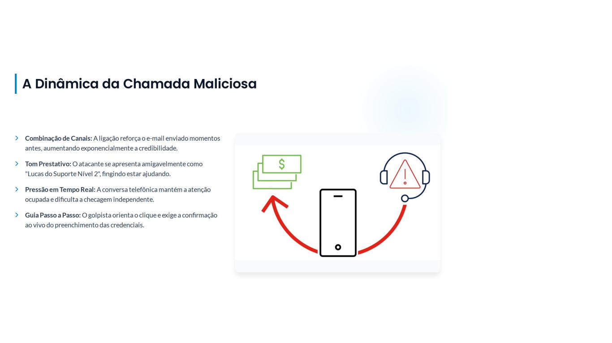
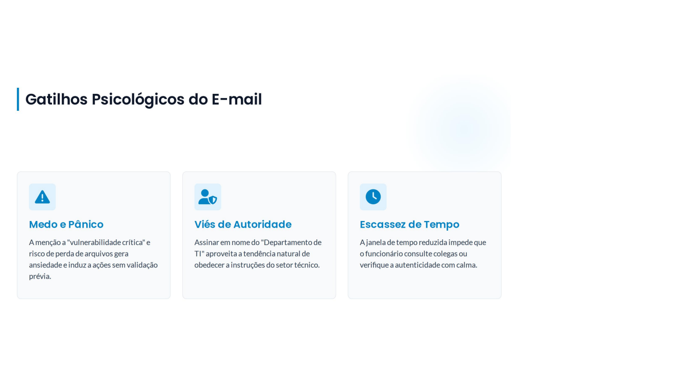
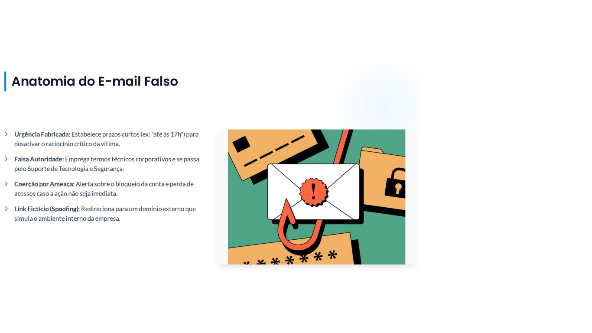
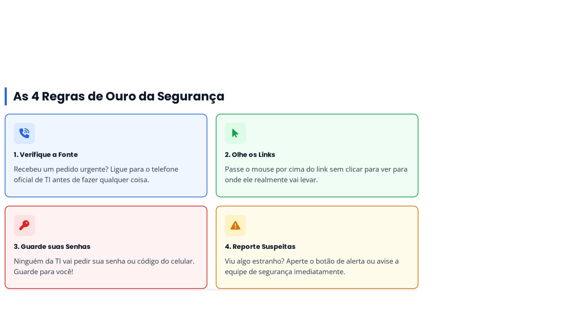
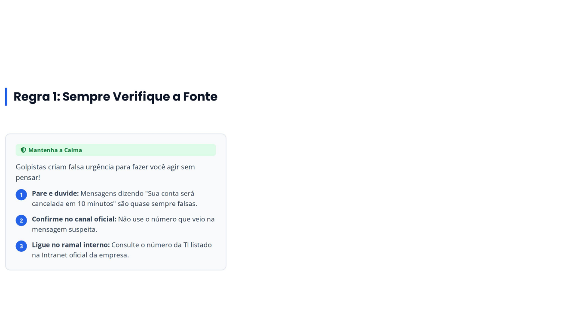
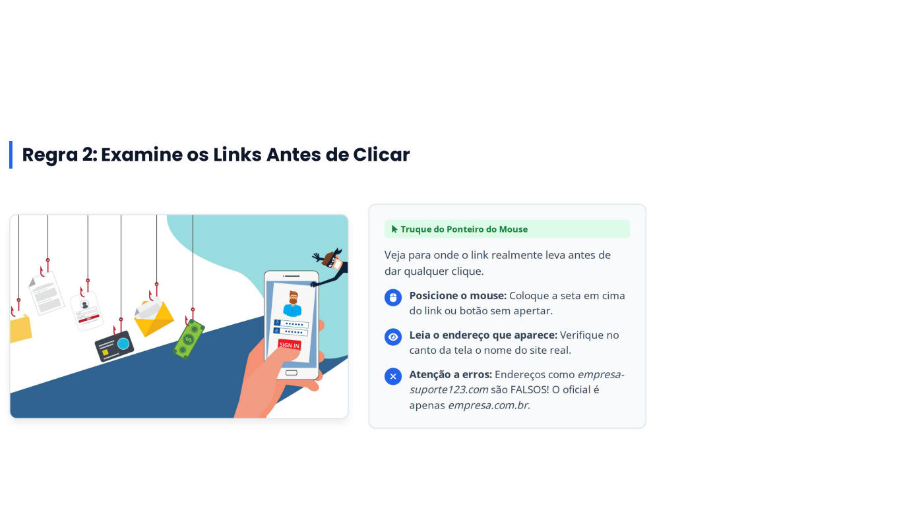
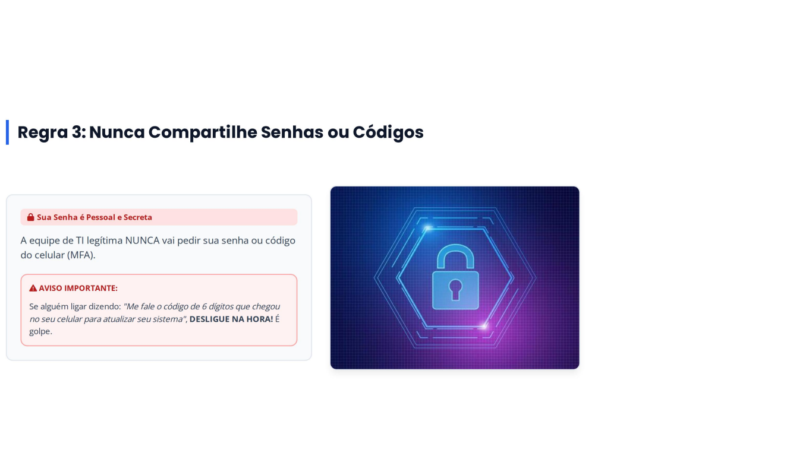
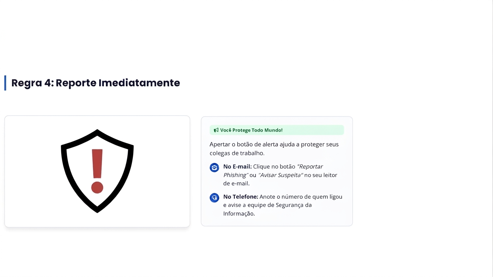

# Engenharia Social com IA: Ameaça Multicanal 🛡️🤖

Projeto desenvolvido para o desafio de projeto "Natty or Not" da DIO, explorando o uso de Inteligências Artificiais Generativas aplicadas a cenários de Cibersegurança e conscientização sobre ataques de engenharia social.

## 📸 Galeria de Imagens do Projeto
Abaixo estão as representações visuais geradas por IA para ilustrar a temática de cibersegurança e engenharia social deste projeto:

1. 
2. 
3. 
4. 
5. 
6. 
7. 
8. 
9. 
10. 
11. 

---

## 💻 Cenário 1: O Phishing "Perfeito" (Texto Gerado por IA)

### E-mail de Phishing Simulado:
> **Assunto:** [Ação Obrigatória] Atualização de Credenciais - Mitigação de Vulnerabilidade
>
> Prezado(a) colaborador(a),
>
> Identificamos uma vulnerabilidade crítica em nossos servidores centrais na última madrugada. Como medida preventiva de mitigação, nossa equipe de Segurança da Informação revogou os tokens de acesso temporários de todos os usuários corporativos.
>
> Para restabelecer a sincronização da sua conta com os sistemas internos (e-mail, VPN e pastas compartilhadas) sem interrupção de suas atividades, é necessário revalidar suas credenciais no portal de segurança até às 17h00 de hoje.

---

## 📞 Cenário 2: O Telefonema de Pressão (Vishing/Roteiro Gerado por IA)

**Contexto:** O golpista liga para o ramal ou celular do colaborador minutos após o envio do e-mail simulado para explorar o fator surpresa e a urgência.

*   **Colaborador:** Alô, [Nome do Colaborador], pois não?
*   **Falso Técnico (Golpista):** Olá, [Nome do Colaborador], aqui é o Lucas, do suporte Nível 2 de TI da central. Tudo bem? Estou ligando porque vimos no painel que seu usuário ainda não concluiu a validação daquela falha de segurança que enviamos por e-mail agora há pouco.
*   **Colaborador:** Ah, sim! Eu vi o e-mail, mas estava no meio de um relatório...
*   **Falso Técnico:** Sem problemas, entendo perfeitamente. O detalhe é que o servidor central vai entrar em manutenção de emergência em 5 minutos. Se a sua conta não for revalidada antes disso, o sistema vai bloquear seu acesso e você vai perder o que não tiver salvo na rede.
*   **Colaborador:** Puxa, sério? O que eu preciso fazer então?
*   **Falso Técnico:** É bem rápido! Abre o e-mail que te enviei com o assunto "[Ação Obrigatória] Atualização de Credenciais". Clica no link azul, coloca seus dados de acesso e me avisa assim que aparecer a tela de confirmação para eu liberar sua máquina por aqui. Estou com a sua ficha aberta no sistema.
*   **Colaborador:** Certo, cliquei no link e estou digitando a senha...
*   **Falso Técnico:** Perfeito! Assim que der o "OK", me confirma para eu dar baixa no chamado. Obrigado pela colaboração!

---

## 🛠️ Tecnologias Utilizadas
- **ChatGPT / Gemini (Texto):** Criação e refinamento do e-mail de phishing e roteiro do telefonema (vishing).
- **IA Generativa de Imagens (Bing Image Creator / Copilot / Outros):** Geração da imagem representativa de segurança cibernética.

## 📖 Reflexão: Natty or Not? (Natural ou Fake?)
- **Not (Fake):** Os textos de phishing e o diálogo de vishing foram 100% gerados por inteligência artificial. Isso demonstra como criminosos conseguem usar a IA para eliminar erros gramaticais e criar ataques extremamente convincentes e personalizados em segundos.
- **Natty (Real - Como se Defender):** Para evitar cair em golpes reais desse tipo:
  1. **Desconfie do senso de urgência:** Golpistas usam prazos apertados (ex: "5 minutos") para te impedir de pensar ou validar a informação.
  2. **Verifique os canais oficiais:** Nunca clique em links de redefinição de senha vindos de e-mails suspeitos. Sempre digite o endereço oficial do portal ou fale com o setor de TI por um número de telefone previamente conhecido.
  3. **Treinamento de Equipe:** Campanhas de simulação de phishing são fundamentais para educar os colaboradores a identificarem esses padrões.
